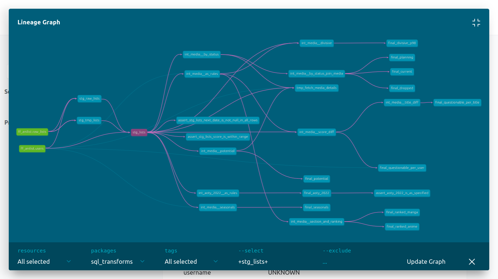

# Fluffy Folks Dashboard

An end-to-end pipeline and dashboard of Fluffy Folks' statistics!

This pipeline:

1. Fetches and stores the historical FF's data from [Anilist](https://anilist.co/)

2. Calculates [many interesting statistics](#statistics) that can be viewed from a dashboard

3. Periodically exports a version of `#rankings` channel content (from Fluffy Folks' discord) to [accessible sheets](https://docs.google.com/spreadsheets/d/1CUSfaHK2nlhUibzl5yADVuSef7hYPdTqOz4yGJSIE54)

4. Created while learning (a lot) about `Airflow`, `dbt`, and `streamlit`

I had planned to deploy the dashboard-ish end result to streamlit cloud, but it turns out that the dashboard is full of images that viewing it would require lots of images to be downloaded. So, I cancelled that plan and the end result is the data in the sheets. I embed [a video](./assets/10-dashboard-demo.webm) below of how the streamlit dashboard look like (it's like a pretty simplistic version of Anichart - mostly because streamlit doesn't offer a way to compose complex structures)

## Why?

1. The statistics seems super interesting!

2. Manual data aggregation in `#rankings` channel seems painful and not as complete

3. I'm learning about pipelines, SQLs, and dashboarding stuffs

See `TODOs.md` for details of unworked TODOs and bugs

## How's It Going

Initially I was just curious about the question, so I ran a query with an already retrieved data (3 months), and at this point I haven't notified my circles yet. Then, BOOM. It just went public just like that, and got [positive response](https://twitter.com/gyrowayne/status/1645010774144983041)


### Other Pics





## Installation & Usage

Moved [here](./INSTALLATION.md)

## Some Notes

- Most of the commands I use are recorded in the [Makefile](./Makefile).

- Some custom terminal stuff that is quite useful

  ```bash
  # Use below command to setup Airflow's command-line autocompletion
  eval "$(register-python-argcomplete airflow)"

  # Silence SQLAlchemy deprecation warning
  # https://stackoverflow.com/a/75109965
  export SQLALCHEMY_SILENCE_UBER_WARNING=1

## Statistics

| Aspects                | Description |
| -----------            | ----------- |
| AOTY 2022              | Anime of the year; best of several pre-defined categories   |
| Favourites             | Top favourited anime, manga, characters, staff, and studio   |
| Ranked Anime           | Ranked anime based on aggregated ratings    |
| Ranked Manga           | Ranked manga based on aggregated ratings    |
| Seasonals              | Ranked anime but it's viewed from within season perspective   |
| Potentials             | Titles that have potentials to be included in ranked    |
| Divisive               | Some people rated it highly, others rated it badly (high [stdev](https://en.wikipedia.org/wiki/Standard_deviation))   |
| Planning (anticipated) | What's people are eagerly waiting for?   |
| Dropped                | What's most hated... ?   |
| Current (followed)     | What's most followed/trending?   |
| Questionable           | Questionable ratings and titles (e.g. high score given for low rated title)   |

## Caveats

A note for my future-self as well!

- I encountered some pip's dependency error when trying to install `jsonschema` which are used by `dbt-core` and `airflow`. Try to install `airflow` first before `dbt-core` (as the former uses `jsonschema` v3, and the latter default to v4.17 but could be made to work with v3)

- Be careful when testing stuff! make sure the `ENVIRONMENT_TYPE` are according to what you're going to be doing, e.g. when you trying to test and there's error when running the command, the env-vars might not be *unset*, and from that point on, it might cause bugs in your dag runs when you're actually don't want to test

- Careful when trying to explore `dbt` stuff while *at the same time* running `Airflow` operations, or doing the other two along with `streamlit` as `sqlite` are **single-threaded** and would throw an error if two operations are running on it at the same time
